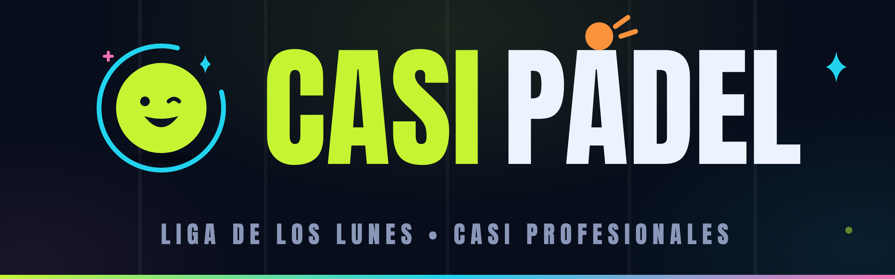

<p align="center">
  
</p>

# Casi Pádel 🎾

**La liga de los lunes, en el bolsillo.** App web mobile-first para gestionar un grupo de pádel: sorteo animado de parejas, fixture automático, carga de resultados en vivo, tabla del día, ranking ELO de temporada e imágenes listas para compartir en el grupo de WhatsApp.

- **App en producción**: <https://leanec.github.io/casipadel>
- **Idioma**: español (rioplatense) · **Diseño**: dark “night pádel”, glass cards, acento lima neón, tipografías Anton + Inter
- **Instalable**: PWA (`standalone`, offline-ready, iconos maskables)

---

## Qué hace

### Jornada del lunes
1. **Sorteo con memoria** — se eligen los 8 jugadores que vinieron y se sortean 4 parejas evitando repeticiones históricas (busca el matching perfecto sobre ~105 combinaciones; si no existe, minimiza duplas repetidas). Animación de revelado con confeti.
2. **Fixture automático** — 3 rondas × 2 canchas = 6 partidos, todos contra todos entre las 4 parejas. Cada cancha se puede reasignar a mano.
3. **Resultados** — modo rápido (tocar el ganador) o detallado por sets: **1 set corto, 2 sets o 2 sets + súper tiebreak a 10**, con validación de marcadores reales (6-x, 7-5, 7-6, TB 10-x).
4. **Tabla del día en vivo** — PJ, PG, sets y diferencia de juegos, ordenada por los criterios de desempate. Se puede **compartir como imagen** en cualquier momento (en curso o terminada).
5. **Cierre y campeones** — al completar los 6 partidos se corona a la pareja campeona (empate total de criterios ⇒ co-campeones), con celebración y resumen compartible.

### Temporada
- **Ranking ELO** — base 1000, K=32, se recalcula siempre desde el historial (nunca se guarda un ELO viejo): partidos, títulos, rachas, movimiento vs. la jornada anterior, sparkline de evolución, forma y mejor dupla.
- **Premios de temporada** — pantalla de awards con líderes de cada categoría.
- **Badges** — 🧹 barrida (3-0 el día), 🔄 remontada (perder el 1er set y ganar), 🔥 rachas y 👑 títulos.
- **Historial** — todas las jornadas con su campeón; se pueden reabrir para corregir o **eliminar** (con confirmación).
- **Compartir** — imágenes 1080×1350 generadas en canvas puro: resumen del día (campeón + tabla + badges), tabla del día y top-5 de la temporada. Web Share API con fallback a descarga.

### Grupo compartido (modo nube)
Un **PIN de 6 dígitos** desbloquea la liga del grupo en cualquier celular. Todos ven lo mismo, en tiempo real:

- **Offline-first**: todo se guarda en `localStorage` y se sincroniza en cuanto hay red (push con debounce, pull al enfocar/reconectar, realtime vía Postgres).
- **Sin conflictos**: guardado atómico por revisión en el servidor; si dos celulares cargaron cosas distintas, la fusión une jugadores y jornadas partido a partido (gana el resultado cargado; en conflicto, el servidor). Las **eliminaciones usan tombstones** para no revivir en otro dispositivo.
- Sin variables de entorno de Supabase, la app funciona **100% local** (modo individual): los tests nunca tocan la red.

---

## Stack

| Capa | Herramientas |
| --- | --- |
| UI | React 19, TypeScript, Tailwind CSS 4, Framer Motion |
| Build | Vite 7, vite-plugin-pwa |
| Datos | `localStorage` (fuente de verdad local) + Supabase (Postgres + Edge Functions en Deno) |
| Tests | Vitest + Testing Library (jsdom) |
| CI/CD | GitHub Actions → GitHub Pages |

## Comandos

```bash
npm install               # dependencias
npm run dev               # desarrollo en http://localhost:5173/casipadel/
npm test                  # suite completa (vitest)
npm run build             # typecheck (tsc) + build de producción → dist/
npm run preview           # sirve el build local
npm run icons             # regenera los iconos PWA (public/)
npm run league:bootstrap  # crea la liga del grupo en Supabase con el PIN (una sola vez)
```

## Estructura

```
src/
├── logic/      # funciones puras + tests: sorteo, fixture, validación de sets,
│               # tabla, ELO, stats, badges, modelos de las imágenes
├── data/       # modelo de datos, store (contexto React), repositorio
│               # localStorage, PIN, fusión (merge) y motor de sincronización
├── screens/    # Home, Ranking, Premios, Jugadores, Nuevo sorteo, Sorteo,
│               # Jornada, Campeón, Historial, Perfil, PinGate
├── components/ # UI: cards, sheets, tabla, nav, botón de compartir…
└── share/      # render de imágenes en canvas + Web Share API
supabase/
├── migrations/ # esquema SQL (tabla leagues + league_meta)
└── functions/  # edge functions league-load / league-save (Deno)
.github/
└── workflows/  # deploy a Pages (test → build → deploy) + keepalive de Supabase
```

Decisiones de diseño: la lógica es **pura y testeable** (`logic/`), las pantallas solo dibujan; el ELO y las tablas **siempre se derivan** del historial en vez de guardarse; las imágenes compartibles separan modelo (`logic/summary.ts`) de dibujo (`share/render.ts`).

## Puesta en marcha del grupo (una sola vez)

1. **Proyecto Supabase** (tier gratis): crear proyecto (región São Paulo) y copiar URL y `anon key` de *Settings → API*.
2. **Base de datos**: SQL Editor → correr `supabase/migrations/0001_init.sql`.
3. **Edge functions**:
   ```bash
   supabase functions deploy league-load  --no-verify-jwt
   supabase functions deploy league-save --no-verify-jwt
   ```
4. **Liga + PIN** (genera el hash PBKDF2 y crea la fila):
   ```bash
   SUPABASE_URL=https://<ref>.supabase.co SUPABASE_SERVICE_ROLE_KEY=<key> \
     npm run league:bootstrap -- --pin 123456
   ```
5. **Deploy**: secrets del repo `VITE_SUPABASE_URL` y `VITE_SUPABASE_ANON_KEY` → push a `main` (Actions builda y publica solo). Mandar el link + el PIN por WhatsApp.

El primer dispositivo que entre con el PIN puede **subir su liga local** (migración del modo individual al grupo).

## Seguridad

- El PIN nunca viaja ni se guarda en el repo: se verifica en las edge functions contra un **hash PBKDF2 (100k iteraciones)** que vive solo en la base de datos.
- Rate limit en memoria: 5 intentos fallidos cada 10 minutos por IP.
- CORS acotado a `leanec.github.io` y `localhost`.
- La `anon key` es pública por diseño; escribir exige conocer el PIN y la revisión actual.

## Deploy y CI

- **`deploy.yml`**: en cada push a `main` → `npm test` → `npm run build` → GitHub Pages. Se copia `index.html` a `404.html` porque Pages no tiene fallback SPA para rutas profundas.
- **`keepalive.yml`**: ping semanal a una edge function para que Supabase free-tier no pause el proyecto.

## Desarrollo

- Los tests no requieren red ni credenciales: sin las variables `VITE_SUPABASE_*` la app corre en modo local.
- Rutas profundas: el `BrowserRouter` usa `basename={import.meta.env.BASE_URL}` (`/casipadel/`).

---

Hecho para un grupo de amigos que juega los lunes 🎾 — sin trackers, sin cuentas, sin servidores que mantener a mano.
